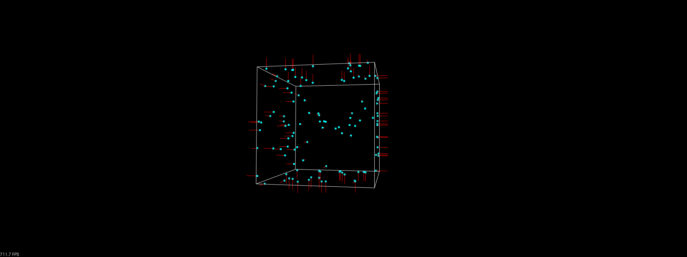
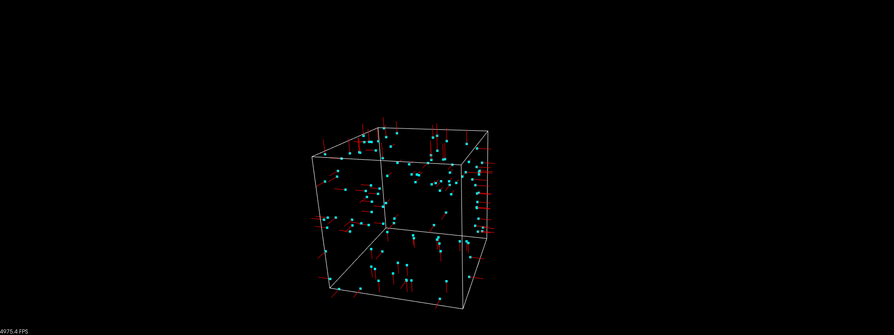

# Point-to-plane ICP

Implementation of point-to-plane Iterative Closest Point (ICP) using symforce.

## Problem Description

This project implements the point-to-plane ICP algorithm using the symforce library. We build a set of points from a cube surface and use ICP to align the points to the surface of the cube by minimizing the distance between points and their corresponding plane.

### Residual


The residual function computes the difference between points and their estimated plane correspondences in the point cloud using the centroid and normal of the plane. As long as the centroid/point correspondence is on the plane, it does not actually matter which point you choose.

The equation for the distance $d$ from a point $P$ to a plane determined by normal vector $N$ and point $Q$ is given by:

$$
d_i = \left| N_w^T \cdot (T_{\text{lidar}}^w \cdot P_{\text{lidar}} - Q_w) \right|
$$

Where:

- $N_w^T$ is the normal vector of the plane in world frame.
- $T_{\text{lidar}}^w$ is the transformation from lidar frame to world frame.
- $P_{\text{lidar}}$ is the point in lidar frame.
- $Q_w$ is the centroid of the plane in world frame.

Then, the residual $R$, which is the sum of all the distances, is given by:

$$
R = \sum\_{i=1}^{N} d_i
$$

## Install

This repo has code for visualizing and running point-to-plane ICP using symforce in both Python and C++

### Run Optimization in Python

To visualize the point-to-plane ICP optimization on a simple cube in python, you can run:

```bash
pip install -r requirements.txt
python3 visualize.py
```

This will also visualize the optimization using Open3D


### Run Optimization in C++

We also have set up C++ code to run the optimization, both as a dynamic-sized problem with variable number of points, and as a fixed-size problem where you know beforehand how many points you are going to optimize. To run the C++ part of the code, you need to compile the project using cmake

```bash
mkdir build
cd build
cmake ..
make
```

#### Generating C++ code

Symforce is a libray that autogenerates highly optimized code in C++. To autogenerate the C++ functions for the point-to-plane residual and the linearization function which includes the Hessian and Jacobian, you can run

```bash
python3 generate.py
```

#### Dynamic-size

The dynamic-sized optimization uses "point_to_plane_factor.h" to create residuals for each point.

```bash
cd build
./run_dynamic_size
```



```bash
[2024-04-26 16:32:50.163] [info] Initial pose: <Pose3d [0, 0, 0, 1, 1, 1, 1]>
[2024-04-26 16:32:50.168] [info] LM<Point-To-PlaneOptimizerDynamic> [iter 0] lambda: 1.000e+00, error prev/linear/new: 6.000e+01/3.593e-02/3.593e-02, rel reduction: 9.99401e-01, gain ratio: 1.00000e+00
[2024-04-26 16:32:50.169] [info] LM<Point-To-PlaneOptimizerDynamic> [iter 1] lambda: 2.500e-01, error prev/linear/new: 3.593e-02/1.988e-06/2.008e-06, rel reduction: 9.99944e-01, gain ratio: 9.99999e-01
[2024-04-26 16:32:50.170] [info] LM<Point-To-PlaneOptimizerDynamic> [iter 2] lambda: 6.250e-02, error prev/linear/new: 2.008e-06/7.739e-11/7.810e-11, rel reduction: 9.99961e-01, gain ratio: 1.00000e+00
[2024-04-26 16:32:50.171] [info] LM<Point-To-PlaneOptimizerDynamic> [iter 3] lambda: 1.562e-02, error prev/linear/new: 7.810e-11/5.766e-16/5.769e-16, rel reduction: 9.99964e-01, gain ratio: 1.00000e+00
[2024-04-26 16:32:50.172] [info] LM<Point-To-PlaneOptimizerDynamic> [iter 4] lambda: 3.906e-03, error prev/linear/new: 5.769e-16/2.876e-22/2.876e-22, rel reduction: 2.06229e-01, gain ratio: 1.00000e+00
[2024-04-26 16:32:50.173] [info] LM<Point-To-PlaneOptimizerDynamic> [iter 5] lambda: 9.766e-04, error prev/linear/new: 2.876e-22/9.216e-30/9.362e-30, rel reduction: 1.29501e-07, gain ratio: 1.00000e+00
[2024-04-26 16:32:50.173] [info] LM<Point-To-PlaneOptimizerDynamic> Optimization finished with status: SUCCESS
[2024-04-26 16:32:50.173] [info] Optimization time: 9 milliseconds
[2024-04-26 16:32:50.173] [info] Iterations: 5
[2024-04-26 16:32:50.173] [info] Lambda: 0.0009765625
[2024-04-26 16:32:50.173] [info] Initial error: 60
[2024-04-26 16:32:50.173] [info] Final error: 9.361560273677476e-30
[2024-04-26 16:32:50.173] [info] Final pose: <Pose3d [-7.25562e-16, 4.46324e-16, -3.88824e-16, 1, -4.78151e-17, 4.36386e-17, 1.41219e-16]>
[2024-04-26 16:32:50.173] [info] Status: SUCCESS
```

#### Fixed-size

The fixed-size optimization uses the "linearization.h" file to create the optimization values directly.

```bash
cd build
./run_fixed_size
```



```bash
[2024-04-26 16:36:23.586] [info] Initial pose: <Pose3d [0, 0, 0, 1, 1, 1, 1]>
[2024-04-26 16:36:23.589] [info] LM<Point-To-PlaneOptimizerFixed> [iter 0] lambda: 1.000e+00, error prev/linear/new: 6.000e+01/3.593e-02/3.593e-02, rel reduction: 9.99401e-01, gain ratio: 1.00000e+00
[2024-04-26 16:36:23.589] [info] LM<Point-To-PlaneOptimizerFixed> [iter 1] lambda: 2.500e-01, error prev/linear/new: 3.593e-02/1.988e-06/2.008e-06, rel reduction: 9.99944e-01, gain ratio: 9.99999e-01
[2024-04-26 16:36:23.590] [info] LM<Point-To-PlaneOptimizerFixed> [iter 2] lambda: 6.250e-02, error prev/linear/new: 2.008e-06/7.739e-11/7.810e-11, rel reduction: 9.99961e-01, gain ratio: 1.00000e+00
[2024-04-26 16:36:23.590] [info] LM<Point-To-PlaneOptimizerFixed> [iter 3] lambda: 1.562e-02, error prev/linear/new: 7.810e-11/5.766e-16/5.769e-16, rel reduction: 9.99964e-01, gain ratio: 1.00000e+00
[2024-04-26 16:36:23.590] [info] LM<Point-To-PlaneOptimizerFixed> [iter 4] lambda: 3.906e-03, error prev/linear/new: 5.769e-16/2.876e-22/2.876e-22, rel reduction: 2.06229e-01, gain ratio: 1.00000e+00
[2024-04-26 16:36:23.591] [info] LM<Point-To-PlaneOptimizerFixed> [iter 5] lambda: 9.766e-04, error prev/linear/new: 2.876e-22/9.281e-30/9.285e-30, rel reduction: 1.29502e-07, gain ratio: 1.00000e+00
[2024-04-26 16:36:23.591] [info] LM<Point-To-PlaneOptimizerFixed> Optimization finished with status: SUCCESS
[2024-04-26 16:36:23.591] [info] Optimization time: 4 milliseconds
[2024-04-26 16:36:23.591] [info] Iterations: 5
[2024-04-26 16:36:23.591] [info] Lambda: 0.0009765625
[2024-04-26 16:36:23.591] [info] Initial error: 60
[2024-04-26 16:36:23.591] [info] Final error: 9.284523075901987e-30
[2024-04-26 16:36:23.591] [info] Final pose: <Pose3d [-7.01005e-16, 4.35194e-16, -3.87603e-16, 1, -5.07319e-17, 1.86957e-17, 1.61011e-16]>
[2024-04-26 16:36:23.591] [info] Status: SUCCESS

```

Notice in particular that the fixed-size optimization is about 2x as fast as when solved as dynamic-size problem `[2024-04-26 16:36:23.591] [info] Optimization time: 4 milliseconds`

### Installing Symforce

To install symforce, follow the official [installation guide](https://github.com/symforce-org/symforce?tab=readme-ov-file#build-with-cmake)
and remember to run the following to use symforce in another CMake project

```bash
make install
```

The CMake files will automatically find symforce, Eigen, FMT and spdlog for you, and are taken from https://github.com/gcross-zipline/find_symforce_example

$$
$$
