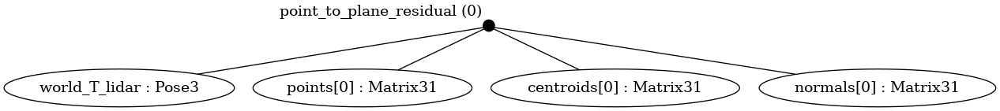

# Point-to-plane ICP

Implementation of point-to-plane Iterative Closest Point (ICP) using symforce.

## Problem Description

This project implements the point-to-plane ICP algorithm using the symforce library. We build a set of points from a cube surface and use ICP to align the points to the surface of the cube by minimizing the distance between points and their corresponding plane.

### Residual



The residual function computes the difference between points and their estimated plane correspondences in the point cloud using the centroid and normal of the plane. As long as the centroid/point correspondence is on the plane, it does not actually matter which point you choose.

The equation for the distance $d$ from a point $P$ to a plane determined by normal vector $N$ and point $Q$ is given by:

$$
d_i = \left| N^T \cdot (T*_lidar^w \cdot P_lidar - Q_w) \right|
$$

Where:

- $N_w^T$ is the normal vector of the plane.
- $T_{\text{lidar}}^w$ is the transformation from lidar frame to world frame.
- $P_{\text{lidar}}$ is the point in lidar frame.
- $Q_w$ is the centroid of the plane in world frame.

Then, the residual $R$, which is the sum of all the distances, is given by:

$$
R = \sum\_{i=1}^{N} d_i
$$

## Install

This repo has code for visualizing and running point-to-plane ICP using symforce in both Python and C++

### Run Python

To visualize the point-to-plane ICP optimization on a simple cube in python, you can run:

```bash
pip install -r requirements.txt
python3 visualize.py
```

This will also visualize the optimization using Open3D


### Generating C++ code

Symforce is a libray that autogenerates highly optimized code in C++. To autogenerate the C++ functions for the point-to-plane residual and the linearization function which includes the Hessian and Jacobian, you can run

```bash
python3 generate.py
```

### Run C++

To run C++ code, you need to compile the project

```bash
mkdir build
cd build
cmake ..
make
./run_dynamic_size
```

### Installing Symforce

To install symforce, follow the official [installation guide](https://github.com/symforce-org/symforce?tab=readme-ov-file#build-with-cmake)
and remember to run the following to use symforce in another CMake project

```bash
make install
```

The CMake files will automatically find symforce, Eigen, FMT and spdlog for you, and are taken from https://github.com/gcross-zipline/find_symforce_example

$$
$$
