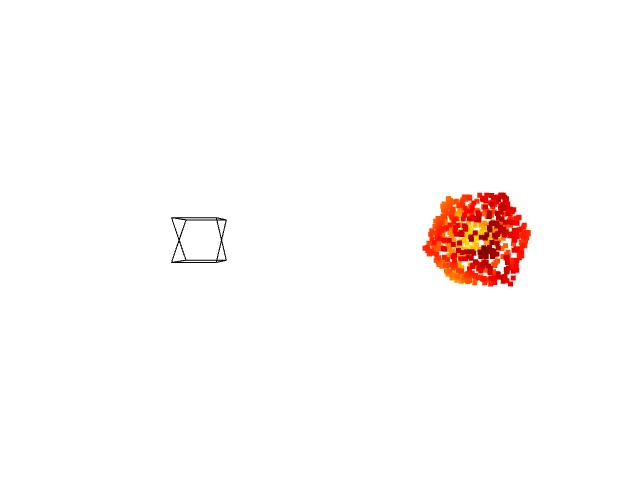

# point-to-plane-ICP

Implementation of point-to-plane Iterative Closest Point (ICP) using symforce.



## Problem Description

This project implements the point-to-plane ICP algorithm using the symforce library. The ICP algorithm is commonly used for aligning two point clouds by minimizing the distance between corresponding points and their corresponding point, line or plane correspodences.

### Residual

The residual function used in this implementation computes the difference between the estimated plane and the corresponding points in the point cloud.

## Install

To install the required dependencies, use the following command:

```bash
pip install -r requirements.txt
```

then you can simply run with

```bash
python3 generate_fixed.py
```
